# 🚀 CloudOps Dashboard

A modern CloudOps Dashboard built with **React**, **Node.js**, **PostgreSQL**, and deployed on **Kubernetes (k3s)** using a complete **GitOps workflow** powered by **GitHub Actions** and **Argo CD**. The platform includes real-time infrastructure monitoring through **Prometheus** and **Grafana**.

---

## 📖 Overview

CloudOps Dashboard is a full-stack DevOps project that demonstrates modern cloud-native deployment practices.

The project automatically builds Docker images, updates Kubernetes manifests, synchronizes deployments using Argo CD, and provides real-time infrastructure monitoring through Prometheus and Grafana.

---

## ✨ Features

- Modern React Dashboard
- REST API built with Node.js & Express
- PostgreSQL Database
- Dockerized Services
- Kubernetes (k3s) Deployment
- GitHub Actions CI/CD Pipeline
- GitOps Deployment with Argo CD
- Automatic Image Updates
- Prometheus Monitoring
- Grafana Dashboards
- Kubernetes Resource Monitoring
- Live CPU & Memory Metrics
- Deployment & Application Management

---

# 🏗️ Architecture

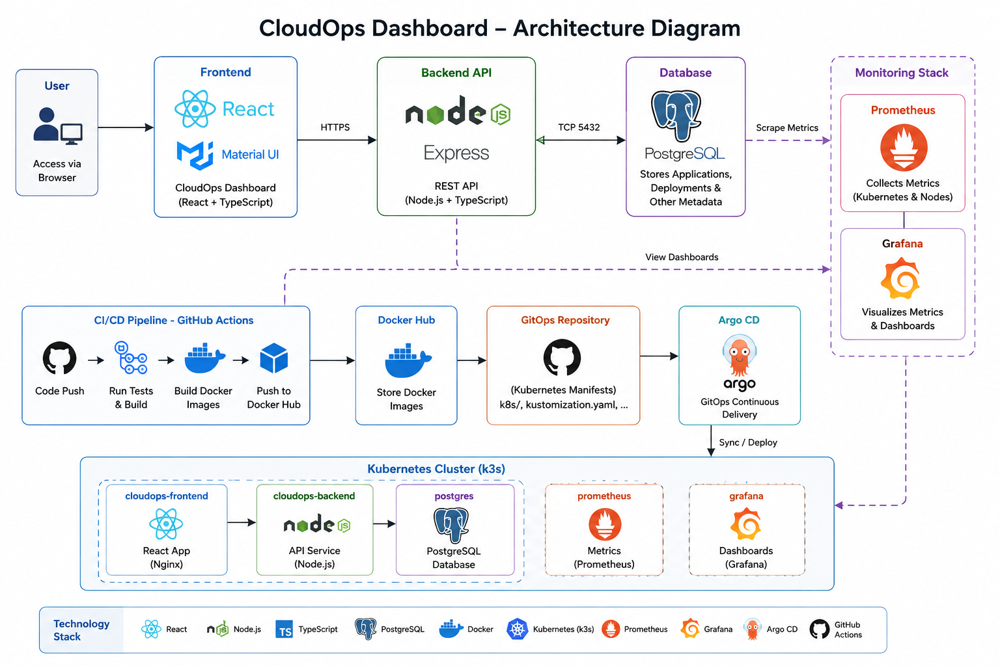

---

# 🛠️ Technology Stack

| Category | Technologies |
|-----------|--------------|
| Frontend | React, TypeScript, Material UI |
| Backend | Node.js, Express |
| Database | PostgreSQL |
| Containerization | Docker |
| Orchestration | Kubernetes (k3s) |
| GitOps | Argo CD |
| CI/CD | GitHub Actions |
| Monitoring | Prometheus |
| Visualization | Grafana |
| Version Control | GitHub |
| Container Registry | Docker Hub |
| Cloud | AWS EC2 |

---

# 🔄 CI/CD Workflow

```
Developer
      │
      ▼
GitHub Repository
      │
      ▼
GitHub Actions
      │
      ▼
Build Docker Images
      │
      ▼
Push Images to Docker Hub
      │
      ▼
Update GitOps Repository
      │
      ▼
Argo CD Detects Changes
      │
      ▼
Deploy to Kubernetes
      │
      ▼
Prometheus Collects Metrics
      │
      ▼
Grafana Visualizes Metrics
```

---

# 📂 Project Structure

```
cloudops-dashboard/
│
├── frontend/
├── backend/
├── .github/workflows/
├── docker-compose.yml
└── README.md

cloudops-dashboard-gitops/
│
└── k8s/
    ├── backend/
    ├── frontend/
    ├── postgres/
    └── kustomization.yaml
```

---

# 📸 Screenshots

## Dashboard Overview

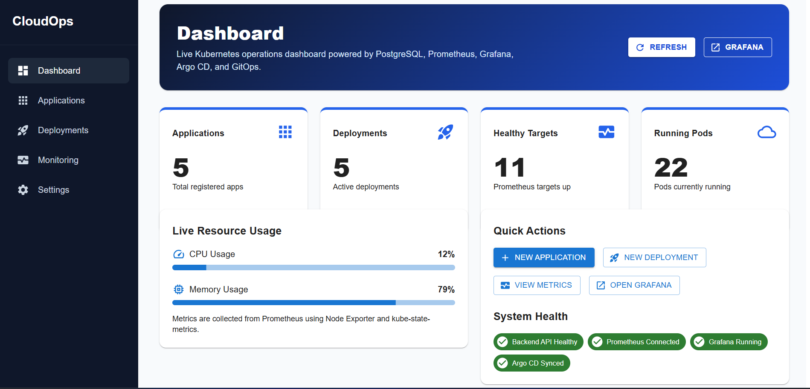

---

## Applications Management

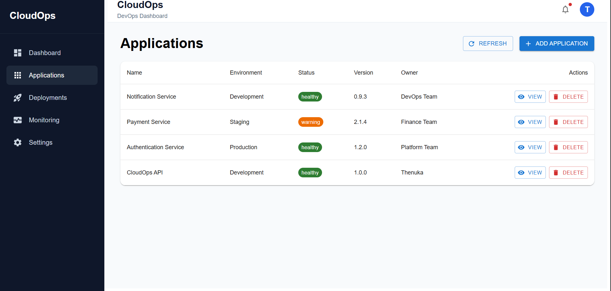

---

## Deployments Management

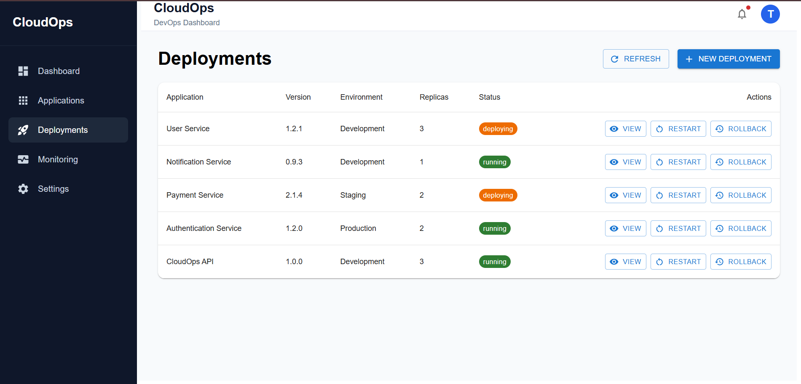

---

## Monitoring Dashboard

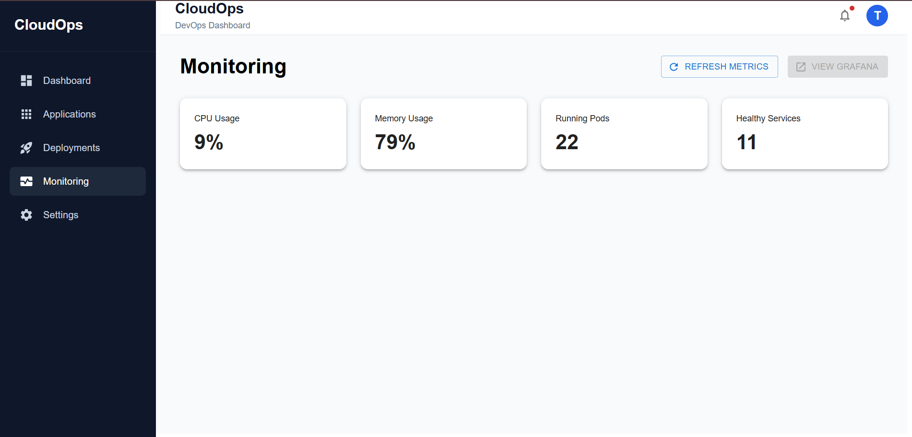

---

## GitHub Actions CI/CD Pipeline

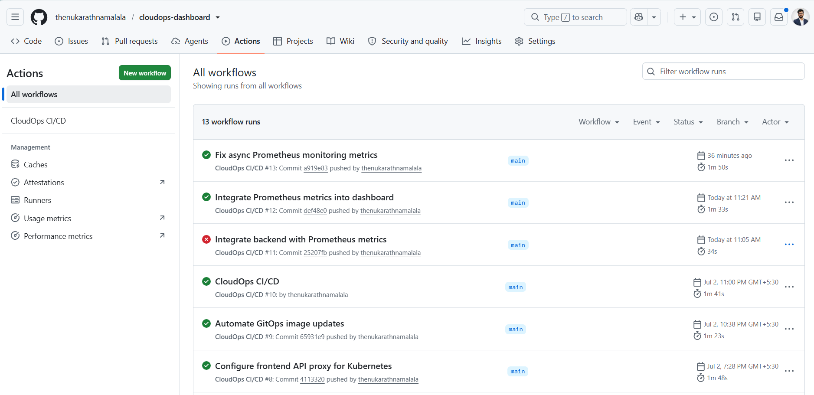

---

## Docker Hub Images

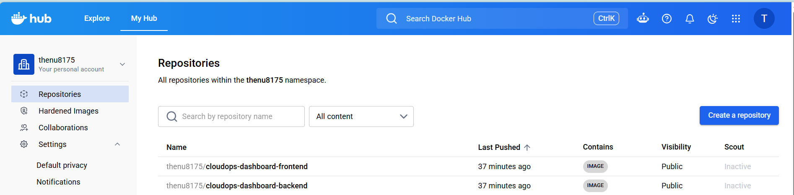

---

## Argo CD GitOps Dashboard

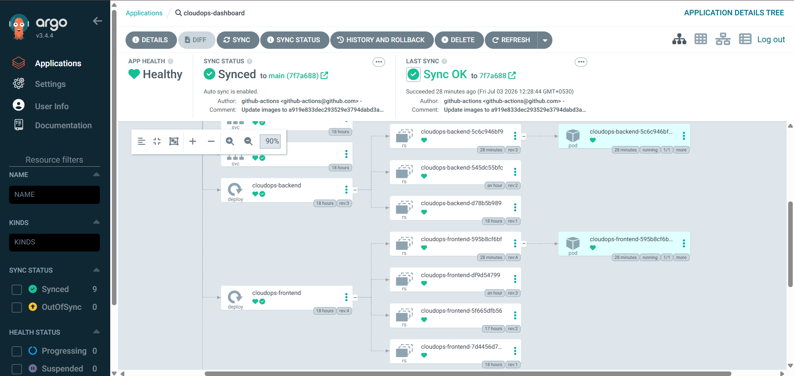

---

## Kubernetes Pods

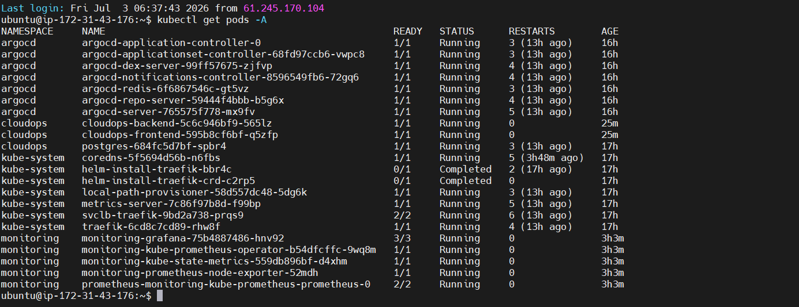

---

## Kubernetes Services

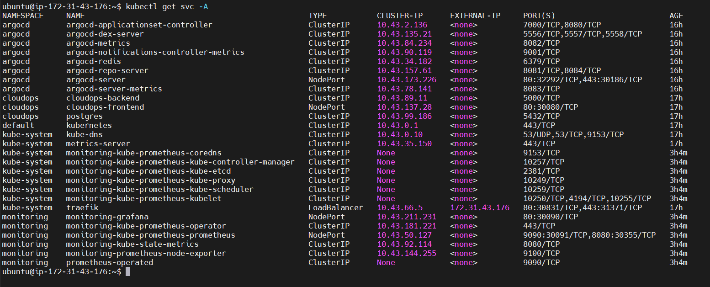

---

## Backend Deployment Configuration

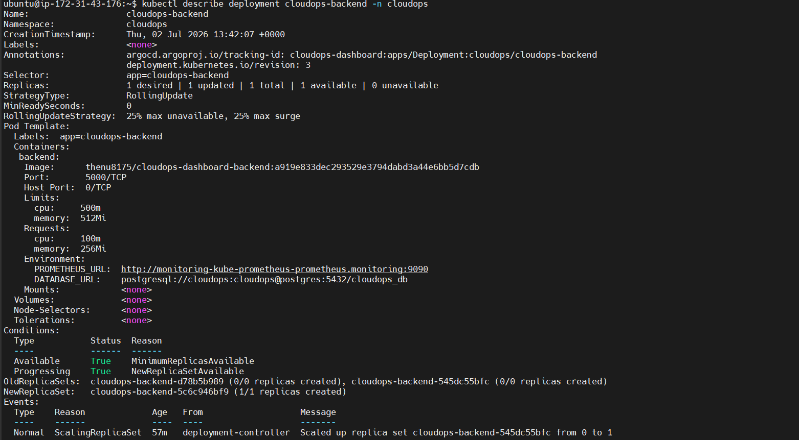

---

## Prometheus Targets

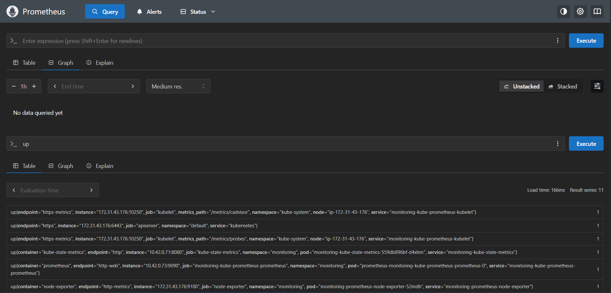

---

## Grafana Home

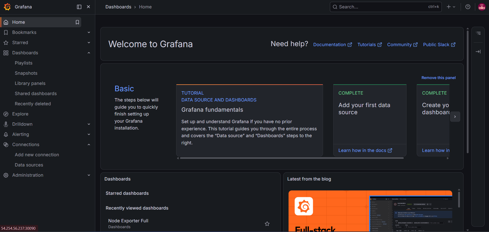

---

## Grafana Monitoring Dashboard

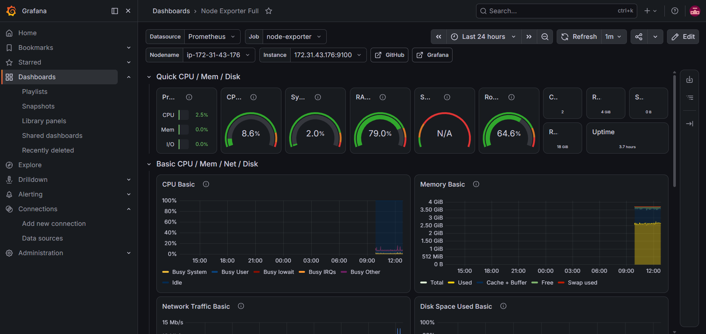

---

## AWS Security Group Configuration

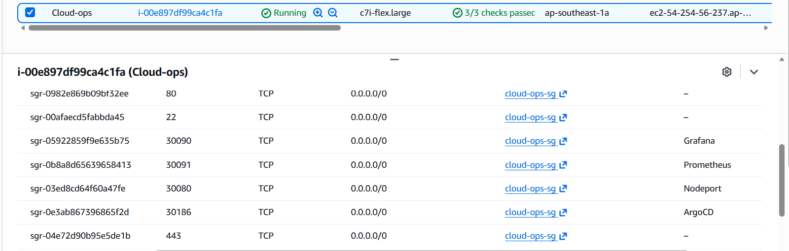

---

# 🚀 Deployment Process

1. Push code to GitHub
2. GitHub Actions builds Docker images
3. Images are pushed to Docker Hub
4. GitOps repository is automatically updated
5. Argo CD detects repository changes
6. Kubernetes performs rolling deployment
7. Prometheus collects cluster metrics
8. Grafana visualizes infrastructure metrics

---

# 📊 Monitoring

The platform provides real-time monitoring through:

- CPU Usage
- Memory Usage
- Running Pods
- Healthy Services
- Kubernetes Cluster Metrics
- Node Metrics
- Container Metrics

---

# ☁️ Infrastructure

- AWS EC2
- Ubuntu Server
- Kubernetes (k3s)
- Docker
- Argo CD
- Prometheus
- Grafana
- PostgreSQL

---

# 🔥 CI/CD Highlights

✅ Automated Docker Image Build

✅ Docker Hub Integration

✅ GitOps Manifest Update

✅ Argo CD Auto Sync

✅ Rolling Kubernetes Deployment

✅ Zero Manual Deployment

---

# 📈 Future Improvements

- Helm Charts
- Terraform Infrastructure Provisioning
- Horizontal Pod Autoscaler
- Ingress Controller

---

# 👨‍💻 Author

**Thenuka Rathnamalala**

GitHub:
https://github.com/thenukarathnamalala

LinkedIn:
https://www.linkedin.com/in/thenukarathnamalala
